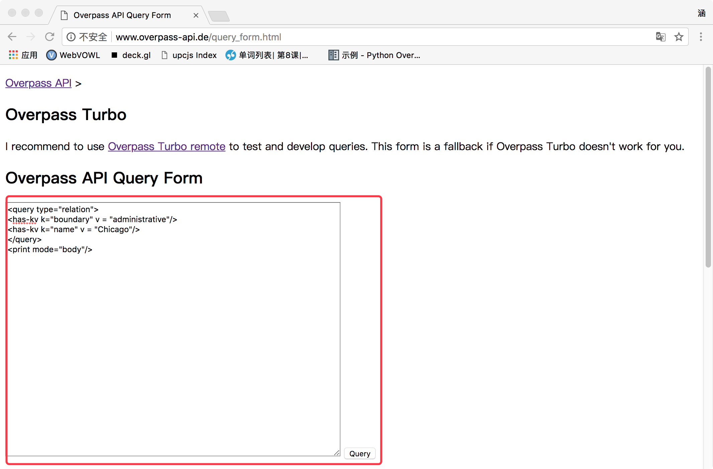
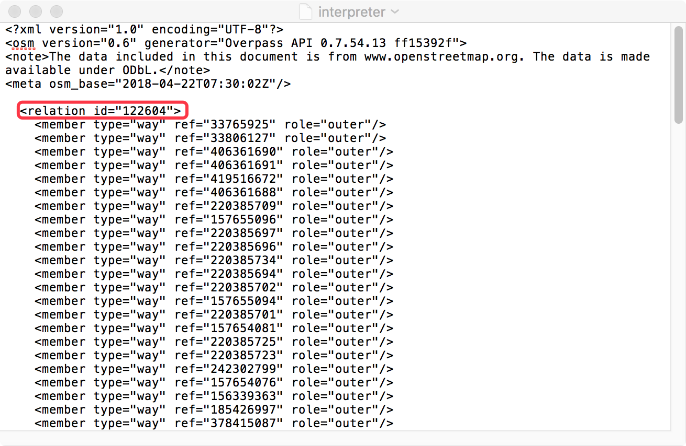
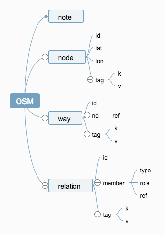

# OpenStreetMap的API使用结构解析

#### 中国石油大学（华东）可视分析小组     吕涵

### 一、OpenStreetMap简介

​        OpenStreetMap（简称OSM）是一项由网络大众共同打造的免费开源、可编辑的地图服务，其开发始于2004年，至今仍在不断更新与扩展。

​        OSM所采集的地理数据完全利用人工，来自世界各地的开发人员与爱好者都可以利用GPS接收器采集数据，并且用OpenStreetMap的网络工具把这些数据添加到收藏记录中。这样将维基百科的模式应用到制作地图上，让全球各地的人都来制作他们自己当地的地图。通过低成本的客户端GPS，人人都可以在行走时采集数据，并将其更新到开放街道图里。这张地图就能实现大众应用、大众编辑。采集到的数据和应用软件的所有权属于贡献者。

​        用户在使用OSM时可通过两种方式：一是选择MapBox为OSM推出的编辑工具iD，二是利用OSM官网提供的各种API接口。

​        本文主要讲解OSM的Overpass API接口使用规则，并解析其所提供的地理数据格式。更多使用方法请访问OSM官方网站https://wiki.openstreetmap.org/wiki/Main_Page。


### 二、利用Open Street Map生成地图文件

​        我们以芝加哥市为例，详细解释Overpass API接口的使用规则。但需要提醒的是，OSM地图多适用于欧洲与北美的地图开发，其他国家和地区的地图信息相对不如欧美完善，请大家使用时根据自己需求选择是否使用OSM。

​       1、访问Overpass API的查询表单。网址http://www.overpass-api.de/query_form.html。

​             网站提供表单查询与转换功能，我们只利用查询与下载功能。

​       2、请求信息表单，获取城市ID。

​             指令框中输入以下代码，第三行“name”后的参数即为目标城市。    

```
<query type="relation">
<has-kv k="boundary" v = "administrative"/>
<has-kv k="name" v = "Chicago"/>
</query>
<print mode="body"/>
```



​        之后点击右下角的Query发出请求，浏览器会弹出下载提醒，单击保存下载数据文件。

​         3、以记事本方式打开上一步下载的文件，找出该城市的地理ID。

​         4、由以上步骤得到芝加哥的城市ID号为122604；但从技术上来讲，这仅是该城市的边界，如果想得到城市的地图，我们需要在该ID号前面加上“3600”，得到ID最终结果为3600122604。

​         5、继续访问步骤二中的API query page，在打开的query框中重新输入以下代码：

```
<osm-script timeout="18000" element-limit="500000000">
 <union>
  <area-query ref="3600122604"/>
  <recurse type="node-relation" into="rels"/>
  <recurse type="node-way"/>
  <recurse type="way-relation"/>
 </union>
 <union>
  <item/>
  <recurse type="way-node"/>
 </union>
 <print mode = "body"/>
 </osm-script>
```

​       说明：<area-query ref="城市的十位ID"/>

​      <osm-script timeout="18000" element-limit="500000000">中表明请求时限和内存限制，城市的地理信息越大，这两个参数都需要适当调大，否则请求失败会返回相应的错误信息。

​         6、点击右下角的query，弹出下载提醒，单击保存下载文件。该文件虽然不显示文档格式，但实际上是xml文档，或者说是osm文档（osm是专属的地理xml格式，其本质仍是xml）。

​              下载完成后，可以通过记事本方式预览该文件，但多数城市的地理文件过大，一般电脑难以打开，以Chicago为例，大概为700M。我们前面简介中提到过MapBox的工具，可以直接使用该文件进行仿真。

### 三、OSM的数据结构

####        （1）认识XML

​        上文已经提到过osm是一种xml的特例，我们先简单了解一下xml。Extensible Markup Language，简称xml，中文名为可扩展标记语言，是一种用于标记电子文件使其具有结构性的标记语言。

​        下面的这条便签使用xml格式保存，具有自我描述性。它拥有标题以及留言，同时包含了发送者和接受者的信息。

```
<note>
<to>George</to>
<from>John</from>
<heading>Reminder</heading>
<body>Don't forget the meeting!</body>
</note>       
```

​        熟悉HTML的同学已经发现了两者的相似性——使用标签来表示信息，我们可以借鉴HTML的结构层次来认识XML，两者在结构上的原理是完全相同的，但是这并不代表这两者是可以互相替代的。

​        HTML 被设计用来显示数据，其焦点是数据的外观，旨在显示信息。

​        XML 被设计为传输和存储数据，其焦点是数据的内容，旨在传输信息。

​        XML 没有预定义的标签，它的标签与结构层次是可以根据用户要求自己规定的，类似于json。        

####    （2）解析OSM层次

​        认识XML之后，我们对OSM的信息结构化也有所了解，但OSM的层次结构是有严格限制的，因此我们说OSM是XML的一种特例。其规定了固定的标签与结构是为了在多方使用OpenStreetMap的地图数据时确保用户之间的兼容。

​        我们以一段简短的OSM文件为例，探究一下其结构层次关系。

```
<?xml version="1.0" encoding="UTF-8"?>
<osm version="0.6" generator="Overpass API 0.7.54.13 ff15392f">
<note>The data included in this document is from www.openstreetmap.org. The data is made available under ODbL.</note>
<meta osm_base="2018-04-20T13:28:02Z" areas="2018-04-20T13:05:02Z"/>

  <node id="26472322" lat="42.0521100" lon="-87.6842496">
    <tag k="highway" v="traffic_signals"/>
  </node>
  <way id="29471008">
    <nd ref="1262464969"/>
    <tag k="highway" v="tertiary"/>
  </way>
  <relation id="7919355">
    <member type="node" ref="3283369100" role="stop"/>
    <tag k="name" v="Evanston Davis Street"/>
  </relation>
</osm>


```

我们使用百度脑图展现OSM数据的基本层次：



#### （3）OSM各级功能

1、note等我们脑图中未展现的信息都不作为地理数据，而是开发版本、编码格式、更新日期和备注等，不直接参与地图的渲染。

2、node通过id进行编号，通过lat、lon做经纬度定义地理坐标点，tag进一步标注该点的类别等信息。

3、way通过2-2000个点（nodes）构成道路。way可表示3种图形事物（非闭合线、闭合线、区域）。对于超过2000 nodes的way，可以通过分割来处理。

4、relation可由一系列nodes,ways 或者其他的relations来组成，相互的关系通过role来定义。一个元素可以在relation中被多次使用，而一个relation可以包含其他的relation。

5、tag不是地图基本元素，但是各元素都通过tag来记录数据信息。通过'key' and  'value'来对数据进行记录。例如，可以通过highway=residential来定义居住区道路；同时，可以使用附加的命名空间来添加附加信息，例如：maxspeed:winter=*就表示冬天的最高限速。

​     具体的tag分类可参看：<http://wiki.openstreetmap.org/wiki/Map_Features>

####  （4）小结

​        了解osm文件的结构之后就可以用它进行开发工作，osm的解析方式有多种，可使用xml解释器或OpenStreetMap官网指定的软件进行解析。另外，官网上提供了多种语言的osm解析或转换代码，做相应开发的同学请访问链接自行选择。https://wiki.openstreetmap.org/wiki/Converting_map_data_between_formats。

​        需要将xml文件转换成json做可视化的同学，可以参照另一篇教程《Python:osm to json》使用python进行相应的转换工作。

### 四、参考文献

1、<http://wiki.openstreetmap.org/wiki/Main_Page>

2、https://blog.csdn.net/xxzj_zz2017/article/details/79524627

3、http://www.w3school.com.cn/xml/index.asp

4、https://blog.csdn.net/scy411082514/article/details/7484497


联系人：李昕                              邮箱：[lix@upc.edu.cn](mailto:lix@upc.edu.cn)